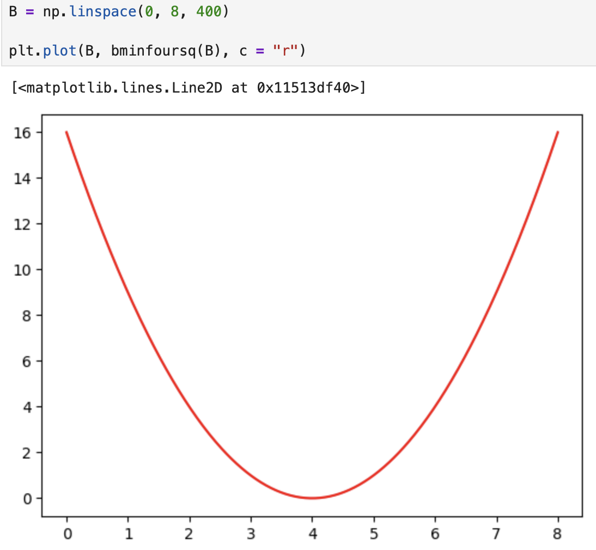
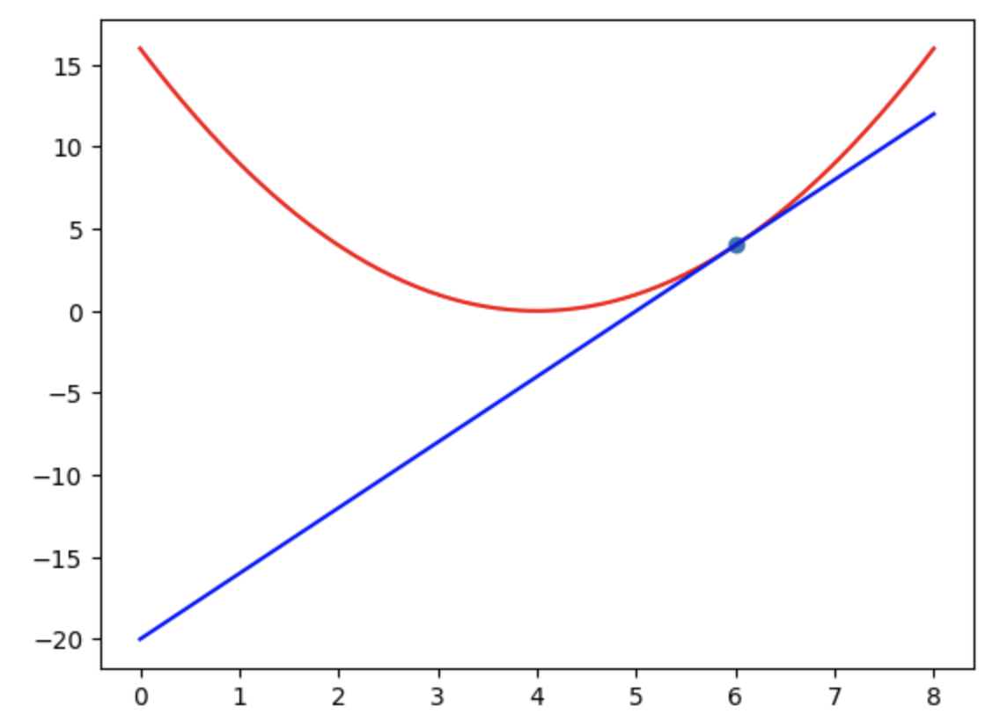
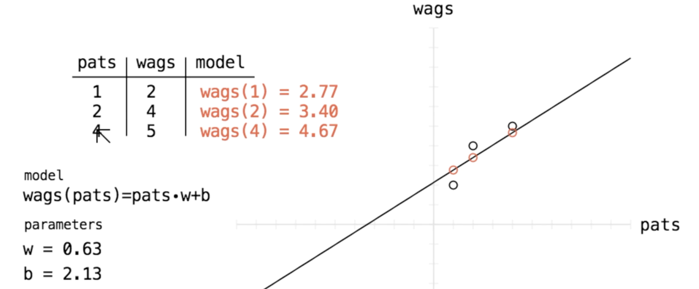
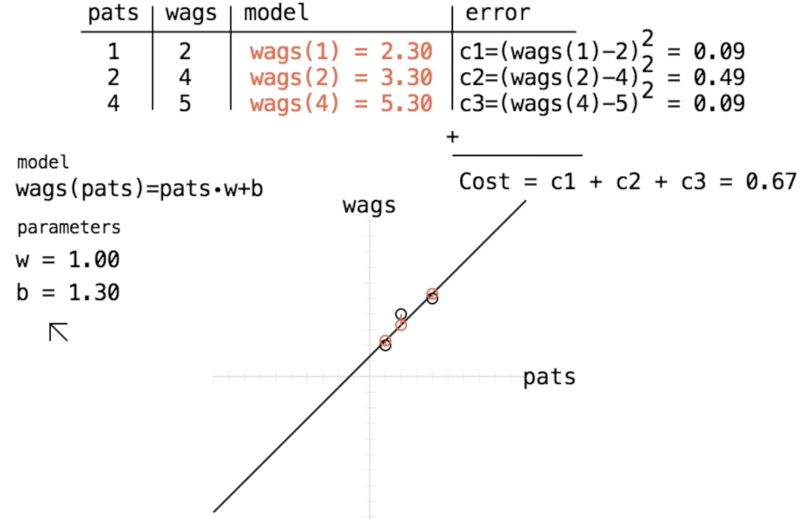
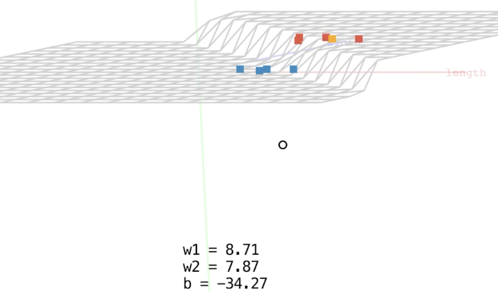
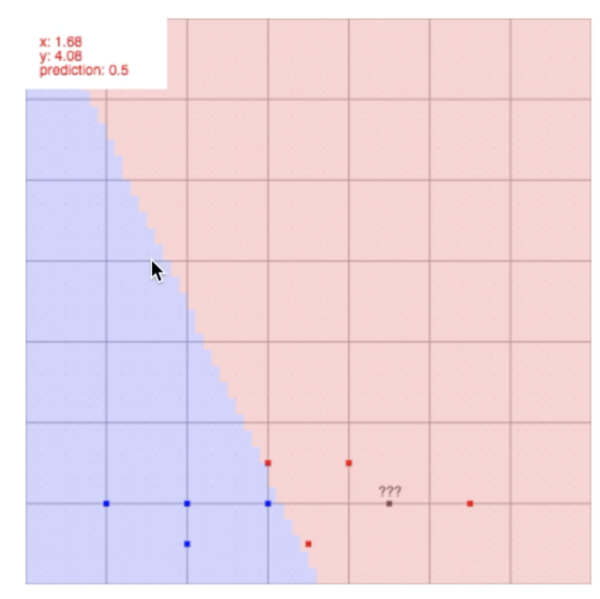

<!-- START doctoc generated TOC please keep comment here to allow auto update -->
<!-- DON'T EDIT THIS SECTION, INSTEAD RE-RUN doctoc TO UPDATE -->
**Table of Contents**  *generated with [DocToc](https://github.com/thlorenz/doctoc)*

- [flowerNeuralNetwork](#flowerneuralnetwork)
  - [Overview](#overview)
  - [About me](#about-me)
  - [State of the art](#state-of-the-art)
  - [A simple example problem](#a-simple-example-problem)
  - [Visualization](#visualization)
  - [Neural Network Solution](#neural-network-solution)
  - [Mathematical representation](#mathematical-representation)
  - [Neural Network Functions](#neural-network-functions)
  - [Sigmoid Function](#sigmoid-function)
  - [Graphing Sigmoid](#graphing-sigmoid)
  - [Making Predictions](#making-predictions)
  - [Interpreting Predictions](#interpreting-predictions)
  - [Changing Predictions](#changing-predictions)
  - [Code set up.](#code-set-up)
    - [In VS Code (Jupyter Notebook)](#in-vs-code-jupyter-notebook)
  - [Cost Function](#cost-function)
  - [Calculus](#calculus)
  - [Solving the flower problem.](#solving-the-flower-problem)

<!-- END doctoc generated TOC please keep comment here to allow auto update -->

# flowerNeuralNetwork

This is a learning exercise to teach myself everything I could possibly want to know about neural networks, from the math behind them to how to create one myself and use it solve my own problem.

I start with a simple dataset and problem to solve.

I use a neural network to automate the task a farmer solves manually.

A data table of flower measurements is created and then visualized using a graph. I learnt how this manual process sets the stage for automation.

---

## Overview

Neural Networks is a really cool field from mathematics and computer science. They sit at the core of artificial intelligence that has taken the world by storm.
Lately, on your phone you can kind ask it a question or upload a photo and it knows who's in it or even what's in it. You may be curious you know how is this is possible. 

These capabilites are being driven by neural networks. This code exercise showcases what
I know about them.

## About me

I have a BSc in Maths which is the sort of background knowledge that helped me to understand the underlying maths. I cover the linear algebra and calculus I need to understand and include in own python code.

##  State of the art

Neural Networks allow computers to actually outperform a human at recognizing stuff in pictures. A competition between a human and an AI transformer trying to identify specific breeds of dogs would illistrate how effective AI can be.
My code will show how you actually train your model using back propagation.

## A simple example problem

A farmer likes to measure everything around her. She was growing some flowers one day and realized she hadn't measured them so she decided that this day was the perfect day to take out her ruler and take some measurements. She has two types of flowers; red ones and blue
ones.
She takes out her ruler, lays the flowers down. She starts with the red flower and plucks a petal off, lays it down, then measures it's width and length. What she needs now is a table to record all of her data.

| Petal Length | Petal Width | Flower Color |
|---|---|---|
| 3 | 1.5 | Red |
| 2 | 1 | Blue |
| 4 | 1.5 | Red |
| 3 | 1 | Blue |
| 4.5 | 1 | ? |

She measured the dimensions of the last petal from a flower but it looks like she forgot to measure the color or just note down the color of this last flower. She's a little upset there's a bit of a mystery here and she cannot be happy unless her data set is complete so she has to think about this problem. There's a few ways that she could solve this that immediately come to her mind she could compare these numbers to the other numbers and maybe um if they're similar she kind of assumes that red flower measurements are all fairly similar. She has a better idea. She's going to graph them.

## Visualization

The farmer then graphs these measurements on a scatter plot:

x is Blue
● is Red

```
    Width (cm)
         2.0|
         1.5|        ●    ●
         1.0|   x    x      ?
         0.0|____________________
           0    2    3    4    5  Length (cm)
```

By plotting the petal length and width, she can visually identify that the mystery flower's measurements (4.5, 1) cluster closer to the red flowers, allowing her to confidently classify it as red.

She does have a bit of doubt but she has a friend and her friend is a computer and the computer has a brain which could do the same task for her if she taught the computer how to do it and we call that brain a neural network.

## Neural Network Solution

A neural network with input and output layers can solve this classification problem:

```
    
    ●
   / \            
  /   \           
 ●     ●
    
L      W
```

The neural network learns to map petal measurements to flower color through training, automating the farmer's classification task at scale.

This could let the computer automate that task that our farmer had to do and the computer can do it a lot faster than her. Let's say there were 10,000 flowers the computer could crunch through that data very quickly and give her an estimate much faster than she could do herself.

## Mathematical representation

If we enter 

```
    
    ● Output
   / \            
  /   \           
 ●2    ●1    
L      W
```


Suppose we enter the numbers from one of our petals then get out a number now we have to interpret this number. The way we interpret it is arbitrary as long as we're consistent we can basically pick anything so we can say if it's close to one that means the computer is trying to tell us it's a red flower and if it's close to zero the computer is trying to tell us it thinks it's looking at measurements from a blue flower. If the output is a08 that's pretty close to one so it means the computer thinks we're looking at a red flower. If you remember these measurements actually came from a blue flower so the neural network was wrong. Mathematically we get 0.8 out of this neural network. We think of it as a function that has two inputs and one output.

## Neural Network Functions

```
    
     ● Output
    / \
  w1   w2         
  /      \           
 ●        ●    
m1        m2
```

The function has two inputs and one output. Let's label the two inputs M1 and M2 (short for measurement one and measurement two since these are measurements from our petals) and the two connections are typically called weights or parameters of the neural network uh and so we'll call them W1 and W2 short for weight one and weight two. Now to get these values closer to the output node you know to work our way towards the output of a neural network we have to weight them. The way you weight them is you just multiply. So you just multiply M1 by W1 and you multiply m2 by W2. Now once they've both been weighted we just add them together and finally we add a bias term. The bias term is another parameter of the neural network um and it allows the neural network to solve certain problems that it couldn't before and it lets the output not completely be dependent on the two measurements.

For this problem we want to squash the values to be between zero and one and a good function to use for that is sigmoid.

```
sigmoid (w1 * m1 + w2 * m2 + b)
```


## Sigmoid Function

The sigmoid function (also called the logistic function) is defined as 

1 / 1 + exp(-x) 

## Graphing Sigmoid


No matter how far I go over to the left and the negative direction the output will never go below zero or even reach zero so sigmoid constrains our input to be between zero and one.  Now we can actually make predictions with our neural network.

## Making Predictions

I define a function called NN which takes two inputs and we'll just basically rebuild the definition here again uh so it's a weighted sum of the measurements and all that means is that it's W1 * M1 + W2 * M2 and we add this bias term. Finally we squash everything with sigmoid again so the output is always between zero and one. Now to make a prediction we need some data. 


```
NN(2,1) = sigmoid (w1 * m1 + w2 * m2 + b)
```

So let's bring our data back in and we're going to replace M1 and M2 with two and one
and if we do that on the left side we have to do the same on the right side.

```
NN(2,1) = sigmoid (w1 * 2 + w2 * 1 + b)
```

An important fact is that the parameters or the weights of the neural network and the bias all start randomly. We randomly assign some values to start getting some predictions.

```
NN(2,1) = sigmoid (.5 * 2 + .2 * 1 + .3)
```

We get sigmoid(1.5) now we can have the computer tell us the answer to that and we'll see how to do that with python later.

## Interpreting Predictions

Sigmoid of 1.5 is approximately 0.82 now we have to interpret this number (our computer's prediction) For these measurements it's telling us 0.82 which is close to one meaning the computer is telling us it thinks it's a red flower. The computer's basically telling us here it thinks the measurements two and one came from a red flower. That is actually not correct because these measurements came from a blue flower. We would have preferred this number to be a lot closer to zero, definitely less than .5.

## Changing Predictions

All the connections in the computer's brain were random to start with. How do we actually help our computer get these predictions closer to what we want? We can change the connections in our computer's brain and the way we do that is by showing him some examples.
We bring back in our data and we'll just show him an example from a red flower to see what the computer outputs. He returns 0.9 and since we want we want a number close to one we say "good job computer". Even though the connections are completely random the guess was actually pretty good so we're not going to make a large change. Look at another example. We'll take measurements from a blue flower and our computer says 0.8. What we really want, since this is a blue flower, is a number close to zero.
We're going to change these connections and that actually brought the number the output of our function down uh so we're all happy here. The actual way that we change those connections is how we're training the neural network and the method used is called back propagation

## Code set up.

I used Visual Studio Code.

I isolated my jupyter notebook in it's own venv, then activated it.

```
$ python3 -m venv ./venv
$ source venv/bin/activate
$ pip3 install jupyter
$ pip3 install ipykernel
```

I installed the machine learning specific libraries, then invoked the notebook.

```
$ python3 -m ipykernel install  --user --name=.venv --display-name "Python (.venv)"
$ pip3 install numpy pandas matplotlib scikit-learn jupyter
$ jupyter notebook
```

Then I made sure I am using my .venv kernel. 

### In VS Code (Jupyter Notebook)
1. Open your notebook.
2. Look at the top right corner.
3. You’ll see the selected Kernel name.

It should say something like:
Python 3.x (.venv)

If it just says “Python 3.x” without .venv, you’re probably not using your virtual environment.

To change it:

1. Click the kernel name
2. Select “Select Another Kernel”
3. Choose the interpreter that points to:
.venv/bin/python

## Cost Function

Is a function, that takes in our farmer's data, and predictions our neural network made on that data, then spits out a single number.

We interpret the cost as how badly our NN is doing; how far out predictions are from what they should be for the given data. Supposing the cost is 0.75, then we want to minimize this number, so that we know predictions are getting closer to what they should be.

Cost function is:

```
    
     ● 0.75
    / \
    COST         
  /      \           
 ●        ●    
data       predictions
```

To reduce 0.75 we can either change the data or the predictions. We can't change the former since this is collected from the real world (petal dimensions). However predictions depend not just on the data but the weights set in our NN.

| Colour | 1 | 0 | 1 |
|---|---|---|---|
| Length | 3   | 2 | 4   |
| Width  | 1.5 | 1 | 1.5 |

The colour is either 1 for red or 0 for blue. 

```
    
     ● 0.2
    / \
   w1  w2    b     
  /      \           
 ●        ●    
3         1.5

We want to bring 0.2 closer to 1 since 3 and 1.5 came from a red flower.
```

The cost function takes the prediction and the True target value (1) and outputs a number. The cost function name is called the squared error function.

(prediction - target)`^2`

(0.2 -1)`^2` = 0.64

So we need to change the w1, w2, and b variables's values. We start with a neural network with no imputs and 1 parameter b.

The prediction is always going to be whatever value b is.

NN() = b

(prediction - target)`^2` is now (b - target)`^2`.

Pretend the target is 4. So we are working with this cost function.

(b - 4)`^2`



We try to minimize this by changing the value b. What does the cost look like as we change b? It is a parabola centered on 4.

The parabola has its minimum at b = 4, where the cost is 0. As b moves away from 4 in either direction, the cost increases quadratically.

What property of the cost function can we use to tell us how to change b? Should we increase it or decrease it? You can use the slope of the cost function.



You can move the blue line along the parabola. When we are above our target value, the tangent line is sloping upwards. When we are below our target value it is sloping downwards. When we need to increase b, we have a negative slope. When we need to decrease b, we have a positive slope. We can subtract the slope of the cost function at b. If b starts less than our target and we subtract the negative number, then we are going to move it closer to our target. The slope of the cost function is zero when we're right at the target value. We have to use a fraction of the slope or else we can overshoot and bounce out of the parabola. If we use too small of a fraction we may never reach the target because we'll just go slower and slower as the slope approaches 0.

How do we get a function that gives us the slope of the cost function at a specific value of b? We need to use calculus. We use the derivative of the cost function, with respect to b.

b = b - (0.1 times slope(b))

If b is 6.48 and slope(b) is 4.96, then b = 6.48 - 0.496 which means b is now 5.98. At this point slope(b) is 3.96 so b now becomes 5.59. This way it pushes b right to the target value and minimizes the cost, till b is 4 and slope(b) is 0.

## Calculus

A rule in calculus can help us find the slope function very quickly. If we start with the function f(x) = x^2, to find the derivative of f(x), we use the derivative operator.

```
d/dx f(x) = d/dx(x^2) = 2x
```

The derivative of f(x) = x² is 2x, which gives us the slope at any point x.

Looking at our cost function cost(b) = (b -4)². The derivative is 2(b - 4)

The general form of the sum of the squared errors cost function.

```
Cost = Σ(i=1 to m) (model(x_i) - target_i)²
```

Σ - sigma (means sum) i from 1 to m, where m is the number of datapoints.

Suppose we want to model the number of tail wags with respect to the number of pats a dog receives.

| Index | Pats | Wags |
|---|---|---|
| 1 | 1 | 2 |
| 2 | 2 | 4 |
| 3 | 4 | 5 |

```
Cost = Σ(i=1 to 3) (wags(pats_i) - wags_i)²
```

You can add 1/m in front of the expression, basically multiplying by 1 over the number of datapoints, then interpret the cost as the average squared error of our model to all the data points.

Below is our model AKA our wags function. It has 2 parameters w & b.

wags(pats) = w.pats + b



The scatter plot shows the relationship between the number of pats (x-axis) and the number of tail wags (y-axis), illustrating the linear pattern in the data. The line position changes if we vary w and/or b.

Given that wags(4) is 0.87 more than the actual real value we want to reduce the difference. 

If we look at what we're trying to do here, we're really trying to minimize these vertical differences between our models outputs and where the data says we should be.

Let's focus in on our first data point.. if we look at the vertical difference, we have our model's output at pats_1 minus the wags for pats_1, aka wags_1

wags(pats_1) - wags_1

Now we want to square the difference, otherwise if we minimize just this we would push our models output negative and it would keep going forever!

We could reduce w till they match, but what we really want to do is minimize the squared difference (wags(pats_1) - wags_1)² which is (wags(4) - 5)².

If we just minimize this and ignore the other data points, we can push it all the way to zero. But alas! we've messed up our models output for the other data points!
So we need one BIG cost function that minimizes EACH of these smaller costs for each point.

That looks like this

cost = (wags(pats_1) - wags_1)² + (wags(pats_2) - wags_2)² + (wags(pats_3) - wags_3)²

If we play with w and b and watch the output of this cost function:

There we go, we found about as good as we can by hand.



Some closing notes:

The general form of the cost function is this, with x being pats in our case and y being wags. 

sigma i=1,m (model(xi) - yi)^2

You can add a 1/m out front if you like, so you can interpret the cost as the average squared difference of your model and the data.

sigma i=1,m 1/m * (model(xi) - yi)^2

Now, not only does this big cost function tell us if some values of w and b are better than others, we can also use it's partial derivative w.r.t w and b to tell us exactly how to change our parameters to find the best fit automatically!

## Solving the flower problem.

Our farmer wants to predict a flowers type, only knowing the width and length of its petal.

Here's what her data looks like:

| length | width | type |
|---|---|---|
| 3 | 1.5 | 1 |
| 2 | 1 | 0 |
| 4 | 1.5 | 1 |
| 3 | 1 | 0 |
| 3.5 | 0.5 | 1 |
| 2 | 0.5 | 0 |
| 5.5 | 1 | 1 |
| 1 | 1 | 0 |
| 4.5 | 1 | ? |

She wants to predict that last flowers colour, and also end up with a neural network that can classify future flowers!

She has two inputs, so her network will have two inputs, length and width

She has one output, so the network will have one output

It will look like this:

nn(length, width) = sigmoid(w1 * length + w2 * width + b)

She uses sigmoid to squash the values between 0 and 1, since the flowers only have two types, she can consider outputs below .5 to be blue and above .5 to be red.

Let's look at what this network can do already:

We scatter some points on the x-z plane and consider the x-axis our length feature, and the z-axis our width feature.

For each grid point, we feed its coordinates into the network and get an output, that becomes the points y coordinate.

Now, we can play with w1 w2 and b and see what they do!



When we try to predict what the mystery flower is we feed it's length and width in to see what the output is. If it is close to 1, we can predict it is a red flower.

So now we need to train this network instead of playing by hand as in the diagram above.



This 3D visualization shows how the neural network divides the feature space (length and width) into regions that classify flowers as red (output near 1) or blue (output near 0).


The training procedure is to pick a random flower from our data, feed in its length and width to the net, and get an output. Then we get the squared error of the output with what it should have been given the data. 

For example, we pick this flower, 2, 1, 0.

We feed in 2, 1 and get out blip.

Because this is a blue flower we want to bring this output lower always.. as close to zero as possible.

Here's what the squared error looks like:

(nn(2,1) - 0)^2

notice that if we replace nn with its definition we just have a function of parameters

cost(w1, w2, b) = (sigmoid(w1*2 + w2 * 1 + b) - 0)^2

We take the partial of the cost w.r.t w1 w2 and b, which will give us three functions:

dcdw1
dcdw2
dcdb

which tell us how to change w1 w2 and b to INCREASE the cost.

We want to decrease the cost, so we instead subtract these partials.

Refer to the cost function video in this playlist on why this works if its hazy.

We update our parameters using a fraction of these partials.. and that will bring the output of our net closer to what we wanted it to be!

Now we repeat with a new random flower, and keep going until our networks output looks reasonable.

Because our dataset is so small, we're not going to split our data into train/test which we should usually do. That's something I'll cover in more advanced NN tutorials.

Ok, look at that! The nets output is looking good.
